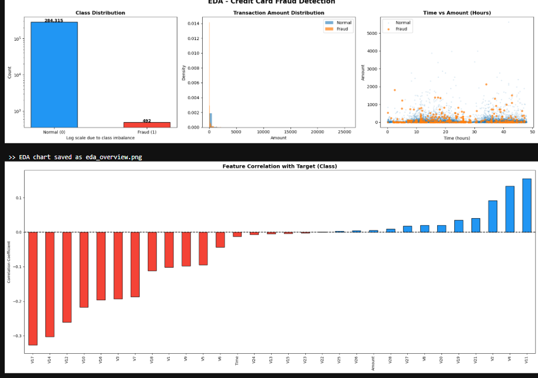
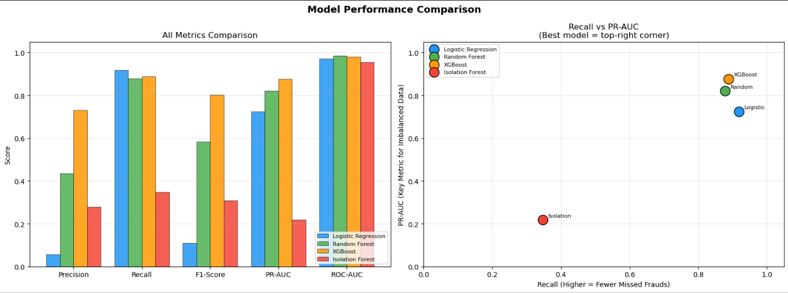
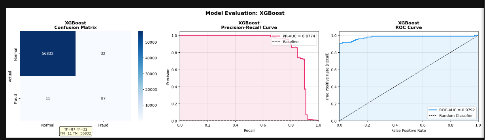

# 💳 Credit Card Fraud Detection

## Overview

Credit card fraud is a challenging machine learning problem because fraudulent transactions make up only a very small fraction of all transactions. Models trained on such imbalanced data often achieve high accuracy while still failing to identify fraudulent transactions.

This project focuses on building a fraud detection pipeline that emphasizes identifying fraudulent transactions rather than simply maximizing overall accuracy. Multiple machine learning models were trained, evaluated, and compared using metrics that are more suitable for imbalanced classification problems.

---

## Objectives

* Understand the characteristics of the dataset through Exploratory Data Analysis (EDA).
* Handle severe class imbalance using SMOTE.
* Train and compare multiple machine learning models.
* Evaluate each model using metrics appropriate for fraud detection.
* Select the best-performing model based on overall performance.

---

## Dataset

The project uses the **Credit Card Fraud Detection Dataset** published on Kaggle.

**Dataset Source**

https://www.kaggle.com/datasets/mlg-ulb/creditcardfraud

### Dataset Summary

* 284,807 transactions
* 492 fraudulent transactions
* Highly imbalanced binary classification problem
* Features V1–V28 are PCA-transformed to protect customer privacy
* Additional features:

  * Time
  * Amount
  * Class (0 = Normal, 1 = Fraud)

---

## Technologies Used

* Python
* Pandas
* NumPy
* Matplotlib
* Scikit-learn
* XGBoost
* Imbalanced-learn (SMOTE)
* Jupyter Notebook

---

# Project Workflow

```
Data Collection
        │
        ▼
Exploratory Data Analysis
        │
        ▼
Data Preprocessing
        │
        ▼
Train-Test Split
        │
        ▼
Feature Scaling
        │
        ▼
SMOTE
        │
        ▼
Model Training
        │
        ▼
Model Evaluation
        │
        ▼
Performance Comparison
```

---

## Exploratory Data Analysis

The first step was understanding the dataset and identifying challenges before training any model.

The analysis focused on:

* Class imbalance
* Transaction amount distribution
* Transaction time patterns
* Correlation between features and the target class

<p align="center">

</p>

The analysis confirmed that fraudulent transactions represent only a tiny percentage of the dataset, making accuracy alone an unreliable evaluation metric.

---

## Data Preprocessing

Before training the models, the following preprocessing steps were performed:

* Missing value check
* Feature scaling for **Time** and **Amount**
* Stratified train-test split
* SMOTE applied only on the training dataset
* Preparation of data for model training

---

## Models Implemented

The following models were trained and evaluated:

* Logistic Regression
* Random Forest
* XGBoost
* Isolation Forest

The first three models are supervised learning algorithms, while Isolation Forest was included as an anomaly detection approach for comparison.

---

## Model Evaluation

Since this is an imbalanced classification problem, evaluation focused on metrics that better reflect fraud detection performance.

The following metrics were used:

* Precision
* Recall
* F1-Score
* PR-AUC
* ROC-AUC

<p align="center">

</p>

The comparison shows the strengths and weaknesses of each model across multiple evaluation metrics instead of relying on accuracy alone.

---

## Best Performing Model

Among the evaluated models, **XGBoost** achieved the best overall balance between Recall, Precision, and PR-AUC, making it the most suitable model for this dataset.

<p align="center">

</p>

---

## Repository Structure

```
credit-card-fraud-detection
│
├── images
│   ├── eda_overview.png
│   ├── model_comparison.png
│   └── xgboost_evaluation.png
│
├── credit_card_fraud_detection.ipynb
├── requirements.txt
├── .gitignore
└── README.md
```

---

## Running the Project

Clone the repository

```bash
git clone https://github.com/Jatin-Sharma29/credit-card-fraud-detection.git
```

Move into the project directory

```bash
cd credit-card-fraud-detection
```

Install the required packages

```bash
pip install -r requirements.txt
```

Launch Jupyter Notebook

```bash
jupyter notebook
```

Open

```
credit_card_fraud_detection.ipynb
```

---

## Future Improvements

Some possible extensions of this project include:

* Hyperparameter tuning using GridSearchCV or Optuna
* Deep learning models for fraud detection
* Real-time prediction API using FastAPI
* Model deployment using Docker and cloud platforms
* Automated model retraining pipeline

---

## Author

**Jatin Sharma** \
**Anirudh Gupta**

If you have suggestions or improvements, feel free to open an issue or submit a pull request.
